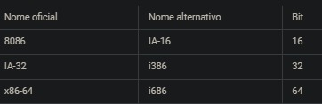
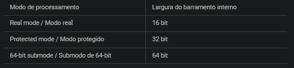
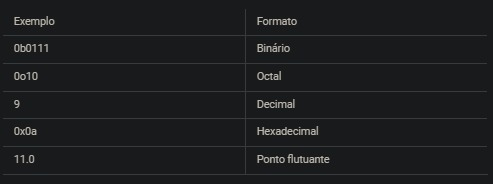
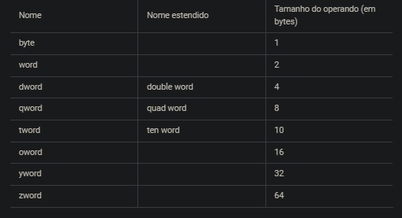
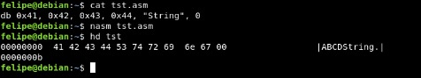
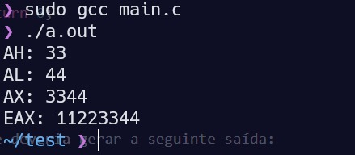
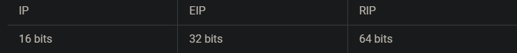
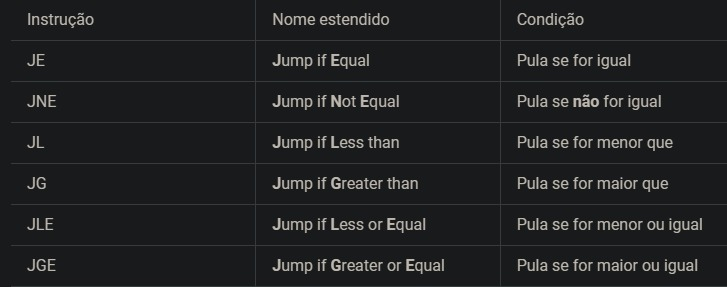
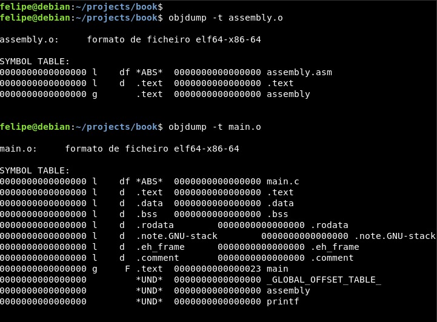
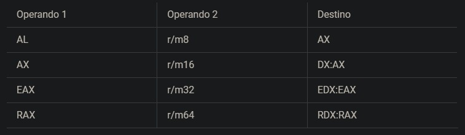

<h1 align="center">Guide Assembly x86 👽</h1>

<p align="center">
 <a href="#Introdução">Introdução</a>&nbsp;&nbsp;&nbsp;|&nbsp;&nbsp;&nbsp;
 <a href="#Porque Assembly">Porque Assembly</a>&nbsp;&nbsp;&nbsp;|&nbsp;&nbsp;&nbsp;
  <a href="#O que é assembly">O que é assembly</a>&nbsp;&nbsp;&nbsp;|&nbsp;&nbsp;&nbsp;
  <a href="#O que é assembler">O que é assembler</a>&nbsp;&nbsp;&nbsp;|&nbsp;&nbsp;&nbsp;
  <a href="#Noção de arquitetura">Noção de arquitetura</a>&nbsp;&nbsp;&nbsp;|&nbsp;&nbsp;&nbsp;
  <a href="#Endianness">Endianness</a>&nbsp;&nbsp;&nbsp;|&nbsp;&nbsp;&nbsp;
  <a href="#Instruções">Instruções</a>&nbsp;&nbsp;&nbsp;|&nbsp;&nbsp;&nbsp;
  <a href="#Modo de processamento">Modo de processamento</a>&nbsp;&nbsp;&nbsp;|&nbsp;&nbsp;&nbsp;
  <a href="#Sintaxe">Sintaxe</a>&nbsp;&nbsp;&nbsp;|&nbsp;&nbsp;&nbsp;
  <a href="#Registradores gerais">Registradores gerais</a>&nbsp;&nbsp;&nbsp;|&nbsp;&nbsp;&nbsp;
  <a href="#Endereçamento">Endereçamento</a>&nbsp;&nbsp;&nbsp;|&nbsp;&nbsp;&nbsp;
  <a href="#Pilha">Pilha</a>&nbsp;&nbsp;&nbsp;|&nbsp;&nbsp;&nbsp;
  <a href="#Saltos">Saltos</a>&nbsp;&nbsp;&nbsp;|&nbsp;&nbsp;&nbsp; 
 <a href="#Procedimentos">Procedimentos</a>&nbsp;&nbsp;&nbsp;|&nbsp;&nbsp;&nbsp; 
 <a href="#Seções e símbolos">Seções e símbolos</a>&nbsp;&nbsp;&nbsp;|&nbsp;&nbsp;&nbsp; 
 <a href="#Instruções assembly x86">Instruções assembly x86</a>&nbsp;&nbsp;&nbsp;|&nbsp;&nbsp;&nbsp; 
</p>

<a id="Introdução"></a>

# Introdução 🥱

Esse e um guia para quem quer aprender Assembly x86 e x86-64.

<a id="Porque Assembly"></a>

#### Por que aprender Assembly ?

1. Engenharia Reversa (de software)
2. Exploração de binários
3. Otimização de código
4. Tarefas de "baixo nível"
5. C & Assembly

<a id="O que é assembly"></a>

# O que é Assembly ? 🧐

De forma resumida Assembly é uma notação em formato de texto das instruções do código de máquina de uma determinada arquitetura. A "arquitetura" ao qual me refiro aqui é a ISA (Instruction Set Architecture) onde ela cria um modelo abstrato de um computador e tem diversas instruções que são computadas pelo processador, essas instruções são o que é conhecido como código de máquina.
Falando de um ponto de vista humano, entender instruções em código de máquina é uma tarefa árdua. Por isso os manuais da ISA costumam simplificar o entendimento da instrução se referindo a ela com uma notação em texto, onde essa notação é conhecida como mnemônico e tem o fim de facilitar o entendimento e a memorização da instrução do processador.
E é justamente dessa notação em texto dos manuais que surgiu o que a gente conhece hoje como "linguagem Assembly". Onde na verdade não existe uma linguagem Assembly (ou ASM para abreviar) mas sim cada ISA tem uma linguagem ASM diferente.
Os programadores antigamente escreviam o código usando a notação em texto (Assembly) e depois, a partir dela, convertiam para código de máquina manualmente. Mas felizmente hoje em dia existem softwares que fazem essa conversão de maneira automática e eles são chamados de assemblers.

<a id="O que é assembler"></a>

# O que é Assembler ? 😄

O assembler é um compilador que converte código em Assembly para o código de máquina.

<a id="Noção de arquitetura"></a>

# Noção de arquitetura 🐵

Antes de ver a linguagem e importante que sabamos sobre a arquitetura do assembly. É claro que não dá para explicar todas as características da arquitetura x86 aqui, só para te dar uma noção o manual para desenvolvedores da Intel tem mais de 5 mil páginas. Mas por enquanto vamos ter apenas uma noção sobre a arquitetura x86 para entender melhor à respeito da mesma.

# O que é arquitetura x86 ? 🏴‍☠️

Essa arquitetura nasceu no 8086, que foi um microprocessador da Intel que fez grande sucesso.
Daí em diante a Intel lançou outros processadores baseados na arquitetura do 8086 ganhando nomes como: 80186, 80286, 80386 etc. Daí surgiu a nomenclatura 80x86 onde o x representaria um número qualquer, e depois a nomenclatura foi abreviada para apenas x86.
A arquitetura evoluiu com o tempo e foi ganhando adições de tecnologias, porém sempre mantendo compatibilidade com os processadores anteriores. O processador que você tem aí pode rodar código programado para o 8086 sem problema algum.
Mais para frente a AMD criou a arquitetura x86-64, que é um superconjunto da arquitetura x86 da Intel e adiciona o modo de 64 bit. Nos dias atuais a Intel e a AMD fazem um trabalho em conjunto para a evolução da arquitetura, por isso os processadores das duas fabricantes são compatíveis.
Ou seja, x86 é um nome genérico para se referir a uma família de arquiteturas de processadores. Por motivos de simplicidade eu vou me referir as arquiteturas apenas como x86, mas na prática estamos abordando três arquiteturas neste README.

<p align="center">
  
</p>

<a id="Endianness"></a>

# Endianness 🤖

A arquitetura x86 é little-endian, o que significa que a ordem dos bytes de valores numéricos segue do menos significativo ao mais significativo. Por exemplo o seguinte valor numérico em hexadecimal 0x1a2b3c4d ficaria disposto na memória RAM na seguinte ordem:

```
  1 4d 3c 2b 1a
```

<a id="Instruções"></a>

# Instruções 🤖

A arquitetura x86 é uma arquitetura <a href="https://pt.wikipedia.org/wiki/CISC">CISC</a> que, resumindo, é uma arquitetura com um conjunto complexo de instruções. Falando de maneira leviana isso significa que há várias instruções e cada uma delas tem um nível de complexidade completamente variada. Boa parte das instruções são complexas na arquitetura x86. Uma instrução "complexa" é uma instrução que faz várias operações.
Cada instrução do código de máquina tem um tamanho que pode variar de 1 até 15 bytes. E cada instrução consome um número de ciclos diferente (devido a sua complexidade variada).

## Modulo

A arquitetura x86 segue o modelo da arquitetura de Von Neumann onde esse, mais uma vez resumindo, trabalha principalmente usando uma unidade central de processamento (CPU) e uma memória principal.

<p align="center">
  
</p>

<p>As instruções podem trabalhar manipulando/lendo dados em registradores que são pequenas áreas de memória internas à CPU. E também pode manipular dados na memória principal que no caso é a memória RAM. Bem como também usar o sistema de entrada e saída de dados, feito pelas portas físicas.
O registrador Program Counter no diagrama acima armazena o endereço da próxima instrução que será executada na memória principal. Na arquitetura x86 esse registrador é chamado de Instruction Pointer.</p>

## Portas físicas

Uma porta física é um barramento do processador usado para se comunicar com o restante do hardware. Por exemplo para poder usar a memória secundária, o HD, usamos uma porta física para enviar e receber dados do dispositivo. O gerenciamento desta comunicação é feito pelo chipset da placa-mãe.
Do ponto de vista do programador uma porta física é só um número especificado na instrução, muito parecido com uma porta lógica usada para comunicação em rede.

## FPU

Na época do 8086 a Intel também lançou o chamado 8087, que é um co-processador de ponto flutuante que trabalhava em conjunto com o 8086. Os processadores seguintes também ganharam co-processadores que receberam o nome genérico de x87. A partir do 80486 a FPU é interna a CPU e não mais um co-processador, porém por motivos históricos ainda chamamos a unidade de ponto flutuante da arquitetura x86 de x87.
FPU nada mais é que a unidade de processamento responsável por fazer cálculos de ponto flutuante, os famosos números float.

## Outras tecnologias

Quem dera um processador fosse tão simples assim, já mencionei que o manual da Intel tem mais de 5 mil páginas? Deixei de abordar muita coisa aqui mas que fique claro que os processadores da arquitetura x86 tem várias outras tecnologias, como o 3DNow! da AMD e o SSE da Intel.

<a id="Modo de processamento"></a>

# Modo de processamento 🤖

Como já explicado a arquitetura x86 foi uma evolução ao longo dos anos e sempre mantendo compatibilidade com os processadores anteriores. Mas código de 16, 32 e 64 bit são demasiadamente diferentes e boa parte das instruções não são equivalentes o que teoricamente faria com que, por exemplo, código de 32 bit fosse impossível de rodar em um processador x86-64. Mas é aí que entra os modos de processamento.
Um processador x86-64 consegue executar código de versões anteriores simplesmente trocando o modo de processamento. Cada modo faz com que o processador funcione de maneira um tanto quanto diferente, fazendo com que as instruções executadas também tenham resultados diferentes.
Ou seja, lá no 8086 seria como se só existisse o modo de 16 bit. Com a chegada dos processadores de 32 bit na verdade simplesmente foi adicionado um novo modo de processamento aos processadores que seria o modo de 32 bit. E o mesmo aconteceu com a chegada dos processadores x86-64 que basicamente adiciona um modo de processamento de 64 bit. É claro que além dos modos de processamento novos também surgem novas tecnologias e novas instruções, mas o modo de processamento anterior fica intacto e por isso se tem compatibilidade com os processadores anteriores.
Podemos dizer que existem três modos de processamento principais:

<p align="center">
  
</p>

## Barramento interno

Os tais "bit" que são muito conhecidos mas pouco entendido, na verdade é simplesmente uma referência a largura do barramento interno do processador quando ele está em determinado modo de processamento. A largura do barramento interno do processador nada mais é que o tamanho padrão de dados que ele pode processar de uma única vez.
Imagine uma enorme via com 16 faixas e no final dela um pedágio, isso significa que 16 carros serão atendidos por vez no pedágio. Se é necessário atender 32 carros então será necessário duas vezes para atender todos os carros, já que apenas 16 podem ser atendidos de uma única vez. A largura de um barramento nada mais é que uma "via de bits", quanto mais largo mais informação pode ser enviada de uma única vez. O que teoricamente aumenta a eficiência.
No caso do barramento interno do processador seria a "via de bits" que o processador usa em todo o seu sistema interno, desconsiderando a comunicação com o hardware externo que é feita pelo barramento externo e não necessariamente tem o mesmo tamanho do barramento interno.

## Mais modos de processamento

Pelo que nós vimos acima então na verdade um "sistema operacional de 64 bit" nada mais é que um sistema operacional que executa em submodo de 64-bit. Ah, mas aí fica a pergunta:

    Se está rodando em 64 bit como é possivel execultar codigo de 32 bit ?

Isso é possível porque existem mais modos de processamento do que os que eu já mencionei. Reparou que eu disse "submodo" de 64-bit? É porque na verdade o 64-bit não é um modo principal mas sim um submodo. A hierarquia de modos de processamento de um processador Intel64 ficaria da seguinte forma:

- Real mode (16 bit)
- Protected mode (32 bit)
- SMM (não vamos falar desse modo, mais ele existe)
- IA-32e
  - 64-bit (64 bit)
  - Compatibility mode (32 bit)

O modo IA-32e é uma adição dos processadores x86-64. Repare que ele tem outro submodo chamado "compatibility mode", ou em português, "modo de compatibilidade".

    Não confundir com o modo de compatibilidade do Windows, ali é uma coisa diferente que leva o mesmo nome.

O modo de compatibilidade serve para obter compatibilidade com a arquitetura IA-32. Um sistema operacional pode setar para que código de apenas determinado segmento na memória rode nesse modo, permitindo assim que ele execute código de 32 e 64 bit paralelamente (supondo que o processador esteja em modo IA-32e). Por isso que seu Debian de 64 bit consegue rodar softwares de 32 bit, assim como o seu Windows 10 de 64 bit também consegue.

## Virtual-8086

Lembra que o antigo Windows XP de 32 bit era capaz de rodar programas de 16 bit do MS-DOS?
Isto era possível devido ao modo Virtual-8086 que, de maneira parecida com o compatibility mode, permite executar código de 16 bit enquanto o processador está em protected mode. Nos processadores atuais o Virtual-8086 não é um submodo de processamento do protected mode mas sim um atributo que pode ser setado
enquanto o processador está executando nesse modo.

<a id="Sintaxe"></a>

# Sintaxe 🤖

O Assembly da arquitetura x86 tem duas versões diferentes de sintaxe: A sintaxe Intel e a sintaxe AT&T.
A sintaxe Intel é a que iremos usar neste livro já que, ao meu ver, ela é mais intuitiva e legível. Também é a sintaxe que o nasm usa, já o GAS suporta as duas porém usando sintaxe AT&T por padrão. É importante saber ler código das duas sintaxes, mas por enquanto vamos aprender apenas a sintaxe do nasm.

## Case Insensitive

As instruções da linguagem Assembly, bem como também as instruções particulares do nasm, são case-insensitive. O que significa que não faz diferença se eu escrevo em caixa-alta, baixa ou mesclando os dois. Veja que cada linha abaixo o nasm irá compilar como a mesma instrução:

```assembly
  mov eax, 777
  Mov Eax, 777
  MOV EAX, 777
  mov EAX, 777
  MoV EaX, 777
```

## Comentários

No nasm se pode usar o ponto-vírgula `;` para comentários que única linha, equivalente ao `//` em C.
Comentários de múltiplas linhas podem ser feitos usando a diretiva pré-processada `%comment` para iniciar o comentário e `%endcomment` para finalizá-lo. Exemplo:

```assembly
; Um exemplo
mov eax, 777 ; Outro exemplo

%comment
  Mais
  um
  exemplo
%endcomment
```

## Números

Números literais podem ser escritos em base decimal, hexadecimal, octal e binário. Também é possível escrever constantes numéricas de ponto flutuante no nasm, conforme exemplos:

<p align="center">
  
</p>

## Strings

Strings podem ser escritas no nasm de três formas diferentes:

<p align="center">
  
</p>

Os dois primeiros são equivalentes e não tem nenhuma diferença para o nasm. O último aceita caracteres de escape no mesmo estilo da linguagem C.

## Formato das instruções

As instruções em Assembly seguem a premissa de especificar uma operação e seus operandos. Na arquitetura x86 uma instrução pode não ter operando algum e chegar até três operandos.

```asm
  operação operando1, operando2, operando3
```

Algumas instruções alteram o valor de um ou mais operandos, que pode ser um endereçamento na memória ou um registrador. Nas instruções que alteram o valor de apenas um operando ele sempre será o operando mais à esquerda. Um exemplo prático é a instrução mov:

```assembly
mov eax, 777
```

O mov especifica a operação enquanto o eax e o 777 são os operandos. Essa instrução altera o valor do operando destino eax para 777. Exemplo de pseudo-código:

```
  eax = 777;
```

ou em C

```C
int eax = 777;
```

    Da mesma forma que não é possível fazer 777 = eaxem linguagens de alto nível,
    também não dá para passar um valor numérico como operando destino para mov. Ou seja, isto está errado:

```
    mov 777, eax ; Erro
```

## Endereçamento

O endereçamento em Assembly x86 é basicamente um cálculo para acessar determinado valor na memória. O resultado deste cálculo é o endereço na memória que o processador irá acessar, seja para ler ou escrever dados no mesmo. Usá-se os colchetes `[]` para denotar um endereçamento. Ao usar colchetes como operando você está basicamente acessando um valor na memória. Por exemplo poderíamos alterar o valor no endereço 0x100 usando a instrução mov para o valor contido no registrador eax.

```asm
mov [0x100], eax
```

    Emdereçamentos se compara com ponteiros em C

    Você só pode usar um operando na memória por instrução. Então não é possível fazer algo como:
    mov [0x100], [0x200]

## Tamanho do operando

Quando um dos operandos é um endereçamento na memória você precisa especificar o seu tamanho.
Ao fazer isso você define o número de bytes que serão lidos ou escritos na memória. A maioria das instruções exigem que o operando destino tenha o mesmo tamanho do operando que irá definir o seu valor, salvo algumas exceções. No nasm existem palavra-chaves (keywords) que você pode posicionar logo antes do operando para determinar o seu tamanho.

<p align="center">
  
</p>

Exemplo:

```asm
mov dword [0x100], 777
```

Se você usar um dos operandos como um registrador o nasm irá automaticamente assumir o tamanho do operando como o mesmo tamanho do registrador. Esse é o único caso onde você não é obrigado a especificar o tamanho porém em algumas instruções o nasm não consegue inferir o tamanho do operando.

## Pseudo-instruções

No nasm existem o que são chamadas de "pseudo-instruções", são instruções que não são de fato instruções da arquitetura x86 mas sim instruções que serão interpretadas pelo nasm. Elas são úteis para deixar o código em Assembly mais versátil mas deixando claro que elas não são instruções que serão executadas pelo processador. Exemplo básico é a pseudo-instrução db que serve para despejar bytes no correspondente local do arquivo binário de saída. Observe:

```asm
db 0x41, 0x42, 0x43, 0x44, "String", 0
```

Dá para especificar o byte como um número ou então uma sequência de bytes em formato de string. Essa pseudo-instrução não tem limite de valores separados por vírgula. Veja a saída do exemplo acima no hexdump, um visualizador hexadecimal:

<p align="center">
  
</p>

## Rótulos

Os rótulos, ou em inglês labels, são definições de símbolos usados para identificar determinados endereços da memória no código fonte em Assembly. Podem ser usados de maneira bastante parecida com os rótulos em C. O nome do rótulo serve para pegar o endereço da memória do byte seguinte a posição do rótulo, que pode ser uma instrução ou um byte qualquer produzido por uma pseudo-instrução.
Para escrever um rótulo basta digitar seu nome seguido de dois-pontos `:`

    meu_rotulo: instrução/pseudo-instrução

Você pode inserir instruções/pseudo-instruções imediatamente após o rótulo ou então em qualquer linha seguinte, não faz diferença no resultado final. Também é possível adicionar um rótulo no final do arquivo, o fazendo apontar para o byte seguinte ao conteúdo do arquivo na memória.

Já vimos um exemplo prático de uso de rótulo na nossa PoC:

```asm
bits 64

global assembly
assembly:
  mov eax, 777
  ret
```

Repare o rótulo assembly na linha 4. Nesse caso o rótulo está sendo usado para denotar o símbolo que aponta para a primeira instrução da nossa função homônima.

## Rótulos locais

Um rótulo local, em inglês local label, é basicamente um rótulo que hierarquicamente está abaixo de outro rótulo. Para definir um rótulo local podemos simplesmente adicionar um ponto . como primeiro caractere do nosso rótulo. Veja o exemplo:

```asm
meu_rotulo:
  mov eax, 777
.subrotulo:
  mov ebx, 555
```

Dessa forma o nome completo de .subrotulo é na verdade meu_rotulo.subrotulo. As instruções que estejam hierarquicamente dentro do rótulo "pai" podem acessar o rótulo local usando de sua nomenclatura com . no início do nome ao invés de citar o nome completo. Como no exemplo:

```asm
meu_rotulo:
  jmp .subrotulo
  mov eax, 777

.subrotulo:
  ret
```

## Diretivas

Parecido com as pseudo-instruções, o nasm também oferece as chamadas diretivas. A diferença é que as pseudo-instruções apresentam uma saída em bytes exatamente onde elas são utilizadas, já as diretivas são como comandos para modificar o comportamento do assembler.
Por exemplo a diretiva `bits` que serve para especificar se as instruções seguintes são de 64, 32 ou 16 bits. Podemos observar o uso desta diretiva na nossa PoC. Por padrão o nasm monta as instruções como se fossem de 16 bits.

<a id="Registradores gerais"></a>

# Registradores gerais 🤖

Seguindo o modelo da arquitetura de Von Neumann, interno a CPU existem pequenos espaços de memória chamados de registers, ou em português, registradores.
Esses espaços de memória são pequenos, apenas o suficiente para armazenar um valor numérico de N bits de tamanho. Ler e escrever dados em um registrador é muito mais rápido do que a tarefa equivalente na memória principal. Do ponto de vista do programador é interessante usar registradores para manipular valores enquanto está trabalhando com eles, e depois armazená-lo de volta na memória se for o caso. Seguindo um fluxo como:

      Registradores = pequenos espaços de memória do CPU

      Registrador = Memória
      Operações com o valor no registrador
      Memória = Registrador

## Mapeamento dos registradores gerais

Afim de aumentar a versatilidade no uso de registradores, para poder manipular dados de tamanhos variados no mesmo espaço de memória do registrador, alguns registradores são subdivido em registradores menores. Isso seria o "mapeamento" dos registradores que faz com que vários registradores de tamanhos diferentes compartilhem o mesmo espaço. Se você entende como funciona uma union em C já deve ter entendido a lógica aqui.

Lá nos primórdios da arquitetura x86 os registradores tinham o tamanho de 16 bits (2 bytes). Os processadores IA-32 aumentaram o tamanho desses registradores para acompanhar a largura do barramento interno de 32 bits (4 bytes). A referência para o registrador completo ganhou um prefixo 'E' que seria a primeira letra de "Extended" (estendido). Processadores x86-64 aumentaram mais uma vez o tamanho desses registradores para 64 bits (8 bytes), dessa vez dando um prefixo 'R' que seria de "Re-extended" (re-estendido). Só que também trazendo alguns novos registradores gerais.

    AX = 16 bits (2 bytes)
    EAX = 32 bits (4 bytes) E = estendido
    RAX = 64 bits (8 bytes) R = re-estendido

## Registradores gerais (IA-16)

Os registradores de propósito geral (GPR na sigla em inglês) são registradores que são, como o nome sugere, de uso geral pelas instruções. Na arquitetura IA-16 nós temos os registradores de 16 bits que são mapeados em subdivisões como explicado acima.

Determinadas instruções da arquitetura usam alguns desses registradores para tarefas específicas mas eles não são limitados somente para esse uso. Você pode usá-los da maneira que quiser porém recomendo seguir o padrão para melhorar a legibilidade do código. O "apelido" na tabela abaixo é o nome dado aos registradores em inglês, serve para fins de memorização.

<p align="center">
  
</p>

Os registradores AX, BX, CX e DX são subdivididos em 2 registradores cada um. Um dos registradores é mapeado no seu byte mais significativo (Higher byte) e o outro no byte menos significativo (Lower byte).
Reparou que os registradores são uma de letra seguido do X? Para simplificar podemos dizer que os registradores são A, B, C e D e o sufixo X serve para mapear todo o registrador, enquanto o sufixo H mapeia o Higher byte e o sufixo L mapeia o Lower byte.

Ou seja se alteramos o valor de AL na verdade estamos alterando o byte menos significativo de AX. E se alteramos AH então é o byte mais significativo de AX. Como no exemplo abaixo:

```asm
mov ah, 0xaa
mov al, 0xbb
; Aqui o valor de AX é 0xaabb
```

Esse mesmo mapeamento ocorre também nos registradores BX, CX e DX. Como podemos ver na tabela abaixo:

<p align="center">
  
</p>

    Obs: Do processador 80386 em diante, em real mode, é possível usar as versões estendidas dos registradores existentes em IA-32. Porém os registradores estendidos de x86-64 só podem ser acessados em submodo de 64-bit.

## Registradores gerais (IA-32)

Já vimos o registrador "EAX" sendo manipulado na nossa PoC. Como o prefixo 'E' indica ele é de 32 bits (4 bytes) de tamanho. Poderíamos simular esse registrador com uma union em C da seguinte forma:

    Para testar o exemplo você pode abrir a pasta src e procurar o nome do teste.

### Teste 1

```c
#include <stdio.h>
#include <stdint.h>

union reg
{
  uint32_t eax;
  uint16_t ax;

  struct
  {
    uint8_t al;
    uint8_t ah;
  };
};

int main(void)
{
  union reg x = {.eax = 0x11223344};

  printf("AH:  %02x\n"
         "AL:  %02x\n"
         "AX:  %04x\n"
         "EAX: %08x\n",
         x.ah,
         x.al,
         x.ax,
         x.eax);

  return 0;
}

```

O que deveria gerar a seguinte saída:

<p align="center">
  
</p>

Podemos testar o mapeamento de EAX com nossa PoC:

### Teste 2

```asm
;Use o arquivo main.c a baixo

bits 64

global assembly
assembly:
  mov eax, 0x11223344
  mov ax,  0xaabb
  ret
```

```c
#include <stdio.h>

int assembly(void);

int main(void)
{
  printf("Resultado: %08x\n", assembly());
  return 0;
}
```

Na linha 8 alteramos o valor de EAX para `0x11223344` e logo em seguida, na linha 9, alteramos AX para `0xaabb`. Isso deveria resultar em EAX = `0x1122aabb`.

    Caso ainda não tenha reparado o retorno da nossa função assembly() é guardado no registrador EAX. Isso será explicado mais para frente nos tópicos sobre convenção de chamada.

## Registradores gerais (x86-64)

Os registradores de propósito geral em x86-64 são estendidos para 64 bits e ganham o prefixo 'R', ficando a lista: RAX, RBX, RCX, RDX, RSP, RBP, RSI, RDI

Todos os registradores gerais em IA-32 são mapeados nos 4 bytes menos significativos dos registradores re-estendidos seguindo o mesmo padrão de mapeamento anterior.

E há também um novo padrão de mapeamento do x86-64 com novos registradores gerais. Os novos nomes dos registradores são uma letra 'R' seguido de um número de 8 a 15.

O mapeamento dos novos registradores são um pouco diferentes. Podemos usar o sufixo 'B' para acessar o byte menos significativo, o sufixo 'W' para acessar a word (2 bytes) menos significativa e 'D' para acessar a doubleword (4 bytes) menos significativa. Usando R8 como exemplo podemos montar a tabela abaixo:

<p align="center">
  
</p>

Em x86-64 também é possível acessar o byte menos significativo dos registradores RSP, RBP, RSI e RDI. O que não é possível em IA-32 ou IA-16. Eles são mapeados em SPL, BPL, SIL e DIL.

## Escrita nos registradores gerais em x86-64

A escrita de dados nos 4 bytes menos significativos de um registrador em x86-64 funciona de maneira um pouco diferente do que nós estamos acostumados. Observe o exemplo:

```asm
mov rax, 0x11223344aabbccdd
mov eax, 0x1234
```

A instrução na linha 2 mudaria o valor de RAX para 0x0000000000001234. Isso acontece porque o valor é zero-extended, ou seja, ele é estendido de forma que os 4 bytes mais significativos de RAX são zerados.

O mesmo vale para todos os registradores gerais, incluindo os registradores R8..R15 caso você escreva algum valor em R8D..R15D.

<a id="Endereçamento"></a>

# Endereçamento 🤖

O processador acessa dados da memória principal usando o que é chamado de endereço de memória. Para o hardware da memória RAM o endereço nada mais é que um valor numérico que serve como índice para indicar qual byte deve ser acessado na memória. Imagine a memória RAM como uma grande array com bytes sequenciais, onde o endereço de memória é o índice de cada byte. Esse "índice" é chamado de endereço físico (physical address).

Porém o acesso a operandos na memória principal é feito definindo alguns fatores que, após serem calculados pelo processador, resultam no endereço físico que será utilizado a partir do barramento de endereço (address bus) para acessar aquela região da memória. Do ponto de vista do programador são apenas algumas somas e multiplicações.

    O endereçamento de um operando também pode ser chamado de endereço efetivo, ou em inglês, effective address.

## Endereçamento em IA-16

No código de máquina da arquitetura IA-16 existe um byte chamado ModR/M que serve para especificar algumas informações relacionadas ao acesso de (R)egistradores e/ou (M)emória. O endereçamento em IA-16 é totalmente especificado nesse byte e ele nos permite fazer um cálculo no seguinte formato:

    REG + REG + DESLOCAMENTO

Onde `REG` seria o nome de um registrador e `DESLOCAMENTO` um valor numérico também somado ao endereço. Os registradores `BX`, `BP`, `SI` e `DI` podem ser utilizados. Enquanto o deslocamento é um valor de 8 ou 16 bits.

Alguns exemplos para facilitar o entendimento:

```asm
mov [bx],           ax ; Correto!
mov [bx+si],        ax ; Correto!
mov [bp+di],        ax ; Correto!
mov [bp+si],        ax ; Correto!
mov [bx+di + 0xa1], ax ; Correto!
mov [si],           ax ; Correto!
mov [0x1a],         ax ; Correto!

mov [dx],    ax ; ERRADO!
mov [bx+bp], ax ; ERRADO!
mov [si+di], ax ; ERRADO!
```

## Endereçamento em IA-32

Em IA-32 o código de máquina tem também o byte SIB que é um novo modo de endereçamento. Enquanto em IA-16 nós temos apenas uma base e um índice, em IA-32 nós ganhamos também um fator de escala. O fator de escala é basicamente um número que irá multiplicar o valor de índice.

- O valor do fator de escala pode ser 1, 2, 4 ou 8.
- O registrador de índice pode ser qualquer um dos registradores gerais exceto ESP.
- O registrador de base pode ser qualquer registrador geral.
- O deslocamento pode ser de 8 ou 32 bits.

Exemplos:

```asm
mov [edx],                      eax ; Correto!
mov [ebx+ebp],                  eax ; Correto!
mov [esi+edi],                  eax ; Correto!
mov [esp+ecx],                  eax ; Correto!
mov [ebx*4 + 0x1a],             eax ; Correto!
mov [ebx + ebp*8 + 0xab12cd34], eax ; Correto!
mov [esp + ebx*2],              eax ; Correto!
mov [0xffffaaaa],               eax ; Correto!

mov [esp*2], eax   ; ERRADO!
```

    SIB é sigla para Scale, Index and Base. Que são os três valores usados para calcular o endereço efetivo.

## Endereçamento em x86-64

Em x86-64 segue a mesma premissa de IA-32 com alguns adendos:

- É possível usar registradores de 32 ou 64 bit.
- Os registradores de R8 a R15 ou R8D a R15D podem ser usados como base ou índice.
- Não é possível mesclar registradores de 32 e 64 bits em um mesmo endereçamento.
- O byte ModR/M tem um novo endereçamento `RIP + deslocamento`. Onde o deslocamento é necessariamente de 32 bits.

```asm
mov [rbx], rax           ; Correto!
mov [ebx], rax           ; Correto! passando para o endereço de 32 bits um valor no registrador de 64 bit
mov [r15 + r10*4], rax   ; Correto!
mov [r15d + r10d*4], rax ; Correto!

mov [r10 + r15d], rax    ; ERRADO!
mov [rsp*2],      rax    ; ERRADO!
```

Na sintaxe do NASM para usar um endereçamento relativo ao RIP deve-se usar a keyword rel para determinar que se trata de um endereço relativo. Também é possível usar a diretiva default rel para setar o endereçamento como relativo por padrão. Exemplo:

```asm
mov [rel my_label], rax

; OU:

default rel
mov [my_label], rax
```

    Na configuração padrão do NASM o endereçamento é montado como um endereço absoluto (default abs). Mais à frente irei abordar o assunto de Position-independent executable (PIE) e aí entenderemos qual é a utilidade de se usar um endereço relativo ao RIP.

## Truque do NASM

Cuidado para não se confundir em relação ao fator de escala. Veja por exemplo esta instrução 64-bit:

```asm
mov [rbx*3], rax
```

Apesar de 3 não ser um valor válido de escala o NASM irá montar o código sem apresentar erros. Isso acontece porque ele converteu a instrução para a seguinte:

```asm
mov [rbx + rbx*2], rax
```

Ele usa RBX tanto como base como também índice e usa o fator de escala 2. Resultando no mesmo valor que se multiplicasse RBX por 3. Esse é um truque do NASM que pode levar ao erro, por exemplo:

```asm
mov [rsi + rbx*3], rax
```

Dessa vez acusaria erro já que a base foi explicitada. Lembre-se que os fatores de escala válidos são 1, 2, 4 ou 8.

## Instrução LEA

    lea registrador, [endereço]

A instrução LEA, sigla para Load Effective Address, calcula o endereço efetivo do segundo operando e armazena o resultado do cálculo em um registrador. Essa instrução pode ser útil para testar o cálculo do effective address e ver os resultados usando nossa PoC, conforme exemplo abaixo:

### Teste 3

```asm
bits 64

global assembly
assembly:
  mov rbx, 5
  mov rcx, 10
  lea eax, [rcx + rbx*2 + 5]
  ret

```

```c

#include <stdio.h>

int assembly(void);

int main(void)
{
  printf("Resultado: %d\n", assembly());
  return 0;
}
```

<a id="Pilha"></a>

# Pilha 🤖

##### Entendendo como a pilha (hardware stack) funciona na arquitetura x86

Uma pilha, em inglês stack, é uma estrutura de dados LIFO -- Last In First Out -- onde o último dado a entrar é o primeiro a sair. Imagine uma pilha de livros onde você vai colocando um livro sobre o outro e, após empilhar tudo, você resolve retirar um de cada vez. Ao retirar os livros você vai retirando desde o topo até a base, ou seja, os livros saem na ordem inversa em que foram colocados. O que significa que o último livro que você colocou na pilha vai ser o primeiro a ser retirado, isso é LIFO.

    LIFO = "Os ultimos serão os primeiro"

## Hardware Stack

Processadores da arquitetura x86 tem uma implementação nativa de uma pilha, que é representada na memória RAM, onde essa pode ser manipulada por instruções específicas da arquitetura ou diretamente como qualquer outra região da memória. Essa pilha normalmente é chamada de hardware stack.

O registrador SP/ESP/RSP, Stack Pointer, serve como ponteiro para o topo da pilha podendo ser usado como referência inicial para manipulação de valores na mesma. Onde o "topo" nada mais é que o último valor empilhado. Ou seja, o Stack Pointer está sempre apontando para o último valor na pilha.

A manipulação básica da pilha é empilhar (push) e desempilhar (pop) valores na mesma. Veja o exemplo na nossa PoC:

# Teste 4

```asm
bits 64

global assembly
assembly:
  mov rax, 12345
  push rax

  mov rax, 112233
  pop rax
  ret
```

```c
#include <stdio.h>

int assembly(void);

int main(void)
{
  printf("Resultado: %d\n", assembly());
  return 0;
}
```

Na linha `6` empilhamos o valor de RAX na pilha, alteramos o valor na linha `8` mas logo em seguida desempilhamos o valor e jogamos de volta em RAX. O resultado disso é o valor 12345 sendo retornado pela função.

A instrução `pop` recebe como operando um registrador ou endereçamento de memória onde ele deve armazenar o valor desempilhado.

A instrução `push` recebe como operando o valor a ser empilhado. O tamanho de cada valor na pilha também acompanha o barramento interno (64 bits em 64-bit, 32 bits em protected mode e 16 bits em real mode). Pode-se passar como operando um valor na memória, registrador ou valor imediato.

A pilha "cresce" para baixo. O que significa que toda vez que um valor é inserido nela o valor de ESP é subtraído pelo tamanho em bytes do valor. E na mesma lógica um pop incrementa o valor de ESP. Logo as instruções seriam equivalentes aos dois pseudocódigos abaixo (considerando um código de 32-bit):

    PUSH
    ESP = ESP - 4
    [ESP] = operando

    POP
    operando = [ESP]
    ESP = ESP + 4

<a id="Saltos"></a>

# Saltos 🤖

Provavelmente você já sabe o que é um desvio de fluxo de código em uma linguagem de alto nível. Algo como uma instrução `if` que condicionalmente executa um determinado bloco de código, ou um `for` que executa várias vezes o mesmo bloco de código. Tudo isso é possível devido ao desvio do fluxo de código. Vamos a um pseudo-exemplo de um `if`:

    1. Compare o valor de X com Y
    2. Se o valor de X for maior, pule para 4.
    3. Adicione 2 ao valor de X
    4.

Repare que se a comparação no passo 1 der que o valor de X é maior, a instrução no passo 2 faz um desvio para o passo 4. Desse jeito o passo 3 nunca será executado. Porém caso a condição no passo 2 for falsa, isto é, o valor de X não é maior do que o valor de Y então o desvio não irá acontecer e o passo 3 será executado.

Ou seja o passo 3 só será executado sob uma determinada condição. Isso é um código condicional, isso é um `if`. Repare que o resultado da comparação no passo 1 precisa ficar armazenado em algum lugar, e este "lugar" é o registrador FLAGS.

## Salto não condicional

Antes de vermos um desvio de fluxo condicional vamos entender como é o próprio desvio de fluxo em si.

Na verdade existem muito mais registradores do que os que eu já citei. E um deles é o registrador `IP`, sigla para Instruction Pointer (ponteiro de instrução). Esse registrador também acompanha o tamanho do barramento interno, assim como os registradores gerais:

<p align="center">
  
</p>

Assim como o nome sugere o Instruction Pointer serve como um ponteiro para a próxima instrução a ser executada pelo processador. Desse jeito é possível mudar o fluxo do código simplesmente alterando o valor de IP, porém não é possível fazer isso diretamente com uma instrução como a mov.

Na arquitetura x86 existem as instruções de jump, salto em inglês, que alteram o valor de IP permitindo assim que o fluxo seja alterado. A instrução de jump não condicional, intuitivamente, se chama JMP. Esse desvio de fluxo é algo muito semelhante com a instrução `goto` da linguagem C, inclusive em boa parte das vezes o compilador converte o `goto` para meramente um JMP.

O uso da instrução JMP é feito da seguinte forma:

    jmp endereço

Onde o operando você pode passar um rótulo que o assembler irá converter para o endereço corretamente. Veja o exemplo na nossa PoC:

# Teste 5

```asm
bits 64

global assembly
assembly:
  mov eax, 555
  jmp .end

  mov eax, 333

.end:
  ret
```

```c
#include <stdio.h>

int assembly(void);

int main(void)
{
  printf("Resultado: %d\n", assembly());
  return 0;
}
```

A instrução na linha 8 nunca será executada devido ao JMP na linha 6.

## Registrador FLAGS

O registrador FLAGS também é estendido junto ao tamanho do barramento interno. Então temos:

<p align="center">
  
</p>

Esse registrador, diferente dos registradores gerais, não pode ser acessado diretamente por uma instrução. O valor de cada bit do registrador é testado por determinadas instruções e são ligados e desligados por outras instruções. É testando o valor dos bits do registrador FLAGS que as instruções condicionais funcionam.

## Salto condicional

Os jumps condicionais, normalmente referidos como Jcc, são instruções que condicionalmente fazem o desvio de fluxo do código. Elas verificam os valores dos bits do registrador FLAGS e, com base nos valores, será decidido se o salto será tomado ou não. Assim como no caso do JMP as instruções Jcc também recebem como operando o endereço para onde devem tomar o salto caso a condição seja atendida. Se ela não for atendida então o fluxo de código continuará normalmente.

Eis a lista dos saltos condicionais mais comuns:

<p align="center">
  
</p>

    O nome Jcc para se referir aos saltos condicionais vem do prefixo 'J' seguido de 'cc' para indicar uma condição, que é o formato da nomenclatura das instruções.
    Exemplo: JLE -- 'J' prefixo, 'LE' condição (Less or Equal)
    Essa mesma nomenclatura também é usada para as outras instruções condicionais, como por exemplo CMOVcc.

A maneira mais comum usada para setar as flags para um salto condicional é a instrução CMP. Ela recebe dois operandos e compara o valor dos dois, com base no resultado da comparação ela seta as flags corretamente. Agora um exemplo na nossa PoC:

# Teste 6

```asm
bits 64

global assembly
assembly:
  mov eax, 0

  mov rbx, 7
  mov rcx, 5
  cmp rbx, rcx
  jle .end

.end:
  ret
```

```c

#include <stdio.h>

int assembly(void);

int main(void)
{
  printf("Resultado: %d\n", assembly());
  return 0;
}
```

Na linha 10 temos um Jump if Less or Equal para o rótulo local `.end`, e logo na linha anterior uma comparação entre RBX e RCX. Se o valor de RBX for menor ou igual a RCX, então o salto será tomado e a instrução na linha 12 não será executada. Desta forma temos algo muito parecido com o `if` no pseudocódigo abaixo:

```c
eax = 0;
    rbx = 7;
    rcx = 5;
    if(rbx > rcx){
      eax = 1;
    }
    return;
```

Repare que a condição para o código ser executado é exatamente o oposto da condição para o salto ser tomado. Afinal de contas a lógica é que caso o salto seja tomado o código não será executado.

    Experimente modificar os valores de RBX e RCX, e também teste usando outros Jcc.

<a id="Procedimentos"></a>

# Procedimentos 🤖

Entendendo funções em Assembly

O conceito de um procedimento nada mais é que um pedaço de código que em determinado momento é convocado para ser executado e, logo em seguida, o processador volta a executar as instruções em sequência. Isso nada mais é que uma combinação de dois desvios de fluxo de código, um para a execução do procedimento e outro no fim dele para voltar o fluxo de código para a instrução seguinte a convocação do procedimento. Veja o exemplo em pseudocódigo:

    1. Define A para 3
    2. Chama o procedimento setarA
    3. Compara A e 5
    4. Finaliza o código

    setarA:
    7. Define A para 5
    8. Retorna

Seguindo o fluxo de execução do código, a sequência de instruções ficaria assim:

    1. Define A para 3
    2. Chama o procedimento setarA
    7. Define A para 5
    8. Retorna
    3. Compara A e 5
    4. Finaliza o código

Desse jeito se nota que a comparação do passo 3 vai dar positiva porque o valor de A foi setado para 5 dentro do procedimento setarA.

<br>
Em Assembly x86 temos duas instruções principais para o uso de procedimentos:

<p align="center">
  
</p>

A esta altura você já deve ter reparado que nossa função assembly na nossa PoC nada mais é que um procedimento chamado por uma instrução CALL, por isso no final dela temos uma instrução RET.

Na prática o que uma instrução CALL faz é empilhar o endereço da instrução seguinte na stack e, logo em seguida, faz o desvio de fluxo para o endereço especificado assim como um JMP. E a instrução RET basicamente desempilha esse endereço e faz o desvio de fluxo para o mesmo. Um exemplo na nossa PoC:
<br/><br/><br/>

# Teste 7

```asm
bits 64

global assembly
assembly:
  mov eax, 3
  call setarA

  ret

setarA:
  mov eax, 5
  ret
```

```c

#include <stdio.h>

int assembly(void);

int main(void)
{
  printf("Resultado: %d\n", assembly());
  return 0;
}
```

Na linha 6 damos um `call` no procedimento `setarA` na linha 10, este por sua vez altera o valor de EAX antes de retornar. Após o retorno do procedimento a instrução `RET` na linha 8 é executada, e então retornando também do procedimento `assembly`.

## O que são convenções de chamadas?

É seguindo essa lógica que "milagrosamente" o nosso código em C sabe que o valor em EAX é o valor de retorno da nossa função assembly. Linguagens de alto nível, como C por exemplo, usam um conjunto de regras para definir como uma função deve ser chamada e como ela retorna um valor. Essas regras são a convenção de chamada, em inglês, calling convention.

Na nossa PoC a função `assembly` retorna uma variável do tipo `int` que na arquitetura x86 tem o tamanho de 4 bytes e é retornado no registrador EAX. A maioria dos valores serão retornados em alguma parte mapeada de RAX que coincida com o mesmo tamanho do tipo. Exemplos:

<p align="center">
  
</p>

Por enquanto não vamos ver a convenção de chamada que a linguagem C usa, só estou adiantando isso para que possamos entender melhor como nossa função assembly funciona.

    Em um código em C não tente adivinhar o tamanho em bytes de um tipo. Para cada arquitetura diferente que você compilar o código, o tipo pode ter um tamanho diferente. Sempre que precisar do tamanho de um tipo use o operador sizeof.

<a id="Seções e símbolos"></a>

# Seções e símbolos 🤖

A esta altura você já deve ter reparado que nossa função `assembly` está em um arquivo separado da função `main`, mas de alguma maneira mágica a função pode ser executada e seu retorno capturado. Isso acontece graças a uma ferramenta chamada linker que junta vários arquivos objetos em um arquivo executável de saída.

## Arquivo objeto

Um arquivo objeto é um formato de arquivo especial que permite organizar código e várias informações relacionadas a ele. Os arquivos .o (ou .obj) que geramos com a compilação da nossa PoC são arquivos objetos, eles organizam informações que serão usadas pelo linker na hora de gerar o executável. Dentre essas informações, além do código em si, tem duas principais que são as seções e os símbolos.

## Seções

Uma seção no arquivo objeto nada mais é que uma maneira de agrupar dados no arquivo. É como criar um grupo novo e dar um sentido para ele. Três exemplos principais de seções são:

- A seção de código, onde o código que é executado pelo processador fica.
- Seção de dados, onde variáveis são alocadas.
- Seção de dados não inicializada, onde a memória será alocada dinamicamente ao carregar o executável na memória. Geralmente usada para variáveis não inicializadas, isto é, variáveis que não têm um valor inicial definido.

Na prática se pode definir quantas seções quiser (dentro do limite suportado pelo formato de arquivo) e para quais propósitos quiser também. Podemos até mesmo ter mais de uma seção de código, mais de uma seção de dados etc. O código em C é organizado pelo compilador, no nosso caso o GCC, e por isso nós não fizemos esse tipo de organização manualmente.

Existem quatro seções principais que podemos usar no nosso código e o linker irá resolvê-las corretamente sem que nós precisamos dizer a ele como fazer seu trabalho. O NASM também reconhece essas seções como "padrão" e já configura os atributos delas corretamente.

- `.text` -- Usada para armazenar o código executável do nosso programa.
- `.data` -- Usada para armazenar dados inicializados do programa, por exemplo uma variável global.
- `.bss` -- Usada para reservar espaço para dados não-inicializados, por exemplo uma variável global que foi declarada mas não teve um valor inicial definido.
- `.rodata` ou `.rdata` -- Usada para armazenar dados que sejam somente leitura (readonly), por exemplo uma constante que não deve ter seu valor alterado em tempo de execução.

      Esses nomes de seções são padronizados e códigos em C geralmente usam essas seções com esses mesmos nomes.

Seções tem flags que definem atributos para a seção, as três flags principais e que nos importa saber é:

- `read` -- Dá permissão de leitura para a seção.
- `write` -- Dá permissão de escrita para a seção, assim o código executado pode escrever dados nela.
- `exec` -- Dá permissão de executar os dados contidos na seção como código.

Na sintaxe do NASM é possível definir essas flags manualmente em uma seção modificando seus atributos. Veja o exemplo abaixo:

```asm
section .text exec

section .data write

section .outra write exec
```

Nos dois primeiros exemplos nada de fato foi alterado nas seções porque esses já são seus respectivos atributos padrão. Já a seção .outra não tem nenhuma permissão padrão definida por não ser nenhum dos nomes padronizados.

## Símbolos

Uma das informações salvas no arquivo objeto é a tabela de símbolos que é, como o nome sugere, uma tabela que define nomes e endereços para determinados símbolos usados no arquivo objeto. Um símbolo nada mais é que um nome para se referir a determinado endereço.
Parece familiar? Pois é, símbolos e rótulos são essencialmente a mesma coisa. A única diferença prática é que o rótulo apenas existe como conceito no arquivo fonte e o símbolo existe como um valor no arquivo objeto.
Quando definimos um rótulo em Assembly podemos "exportá-lo" como um símbolo para que outros arquivos objetos possam acessar aquele determinado endereço. Já vimos isso ser feito na nossa PoC, a diretiva `global` do NASM serve justamente para definir que aquele rótulo é global... Ou seja, que deve ser possível acessá-lo a partir de outros arquivos objetos.

## Linker

O linker é o software encarregado de processar os arquivos objetos para que eles possam "conversar" entre si. Por exemplo, um símbolo definido no arquivo objeto assembly.o para que possa ser acessado no arquivo main.o o linker precisa intermediar, porque os arquivos não vão trocar informação por mágica.

Na nossa PoC o arquivo objeto main.o avisa para o linker que ele está acessando um símbolo externo (que está em outro arquivo objeto) chamado assembly. O linker então se encarrega de procurar por esse símbolo, e ele acaba o achando no assembly.o. Ao achar o linker calcula o endereço para aquele símbolo e seja lá aonde ele foi utilizado em main.o o linker irá colocar o endereço correto.

Todas essas informações (os locais onde foi utilizado, o endereço do símbolo, os símbolos externos acessados, os símbolos exportados etc.) ficam na tabela de símbolos. Com a maravilhosa ferramenta objdump do GCC podemos ver a tal da tabela de símbolos nos nossos arquivos objetos. Basta rodar o comando:

```bash
objdump -t arquivo_objeto.o
```

Se usarmos essa ferramenta nos nossos arquivos objetos podemos ver que, dentre vários símbolos lá encontrados, um deles é o assembly.

<p align="center">
  
</p>

## Executável

Depois do linker fazer o trabalho dele, ele gera o arquivo final que nós normalmente chamamos de executável. O executável de um sistema operacional nada mais é que um arquivo objeto que pode ser executado.

A diferença desse arquivo objeto final para o arquivo objeto anterior, é que esse está organizado de acordo com as "exigências" do sistema operacional e pronto para ser rodado. Enquanto o outro só tem informação referente àquele arquivo fonte, sem dar as informações necessárias para o sistema operacional poder rodá-lo como código. Até porque esse código ainda não está pronto para ser executado, ainda há símbolos e outras dependências para serem resolvidas pelo linker.

<a id="Instruções assembly x86"></a>

# Instruções assembly x86 🤖

Entendendo algumas instruções do Assembly x86

Até agora já foram explicados alguns dos conceitos principais da linguagem Assembly da arquitetura x86, agora que já entendemos como a base funciona precisamos nos munir de algumas instruções para poder fazer códigos mais complexos. Pensando nisso vou listar aqui algumas instruções e uma explicação bem básica de como utilizá-las.

## Formato da instrução

Já expliquei a sintaxe de uma instrução no NASM mas não expliquei o formato em si da instrução no código de máquina. Para simplificar uma instrução pode ter os seguintes operandos:

- Um operando registrador
- Um operando registrador OU operando na memória
- Um operando imediato, que é um valor numérico que faz parte da instrução.

Basicamente são três tipos de operandos: Um registrador, valor na memória e um valor imediato. Um exemplo de cada um para ilustrar sendo mostrado como o segundo operando de MOV:

```asm
mov eax, ebx      ; EBX   = Registrador
mov eax, [ebx]    ; [EBX] = Memória
mov eax, 65       ; 65    = Valor imediato
mov eax, "A"      ; "A"   = Valor imediato, mesmo que 65
```

    Como demonstrado na linha 4 strings podem ser passadas como um operando imediato. O assembler irá converter a string em sua respectiva representação em bytes, só que é necessário ter atenção em relação ao tamanho da string que não pode ser maior do que o operando destino.

São três operandos diferentes e cada um deles é opcional, isto é, pode ou não ser utilizado pela instrução (opcional para a instrução e não para nós).

Repare que somente um dos operandos pode ser um valor na memória ou registrador, enquanto o outro é especificamente um registrador. É devido a isso que há a limitação de haver apenas um operando na memória, enquanto que o uso de dois operandos registradores é permitido.

## Notação

    Irei utilizar uma explicação simplificada aqui que irá deixar muita informação importante de fora.

As seguintes nomenclaturas serão utilizadas:

<p align="center">
  
</p>

Em alguns casos eu posso colocar um número junto a essa nomenclatura para especificar o tamanho do operando em bits. Por exemplo `r/m16` indica um operando registrador/memória de 16 bits.

Em cada instrução irei apresentar a notação demonstrando cada combinação diferente de operandos que é possível utilizar. Lembrando que o `operando destino` é o mais à esquerda, enquanto que o `operando fonte` é o operando mais à direita.

Cada nome de instrução em Assembly é um mnemônico, que é basicamente uma abreviatura feita para fácil memorização. Pensando nisso leia cada instrução com seu nome extenso equivalente para lembrar o que ela faz. No título de cada instrução irei deixar após um "|" o nome extenso da instrução para facilitar nessa tarefa.

## MOV | Move

```asm
mov reg, r/m
mov reg, imm
mov r/m, reg
mov r/m, imm
```

Copia o valor do operando fonte para o operando destino.

```c
 int destiny = source;
```

## ADD

```asm
add reg, r/m
add reg, imm
add r/m, reg
add r/m, imm
```

Soma o valor do operando destino com o valor do operando fonte, armazenando o resultado no próprio operando destino.

```c
int destiny = destiny + source;
```

## SUB | Subtract

```asm
sub reg, r/m
sub reg, imm
sub r/m, reg
sub r/m, imm
```

Subtrai o valor do operando destino com o valor do operando fonte.

```c
int destiny = destiny - source;
```

## INC | Increment

```asm
inc r/m
```

Incrementa o valor do operando destino em 1.

```c
destiny++;
```

## DEC | Decrement

```asm
dec r/m
```

Decrementa o valor do operando destino em 1.

```c
destiny--;
```

## MUL | Multiplicate

```asm
mul r/m,
```

Multiplica uma parte do mapeamento de RAX pelo operando fonte passado. Com base no tamanho do operando uma parte diferente de RAX será multiplicada e o resultado armazenado em um registrador diferente.

<p align="center">
  
</p>

No caso por exemplo de DX:AX, os registradores de 16 bits são usados em conjunto para representar um valor de 32 bits. Onde DX armazena os 2 bytes mais significativos do valor e AX os 2 bytes menos significativos.

```c
// Se operando de 8 bits
AX = AL * operand;


// Se operando de 16 bits
aux = AX * operand;
DX  = (aux & 0xffff0000) >> 16;
AX  = aux & 0x0000ffff;
```

## DIV | Divide

```asm
div r/m
```

Seguindo uma premissa inversa de MUL, essa instrução faz a divisão de um valor pelo operando fonte passado e armazena o quociente e a sobra dessa divisão.

<p align="center">
  
</p>

```c
// Se operando de 8 bits
AL = AX / operand;
AH = AX % operand;
```

## LEA | Load Effective Address

```asm
lea reg, mem
```

Calcula o endereço efetivo do operando fonte e armazena o resultado do cálculo no registrador destino. Ou seja, ao invés de ler o valor no endereço do operando na memória o próprio endereço resultante do cálculo de endereço será armazenado no registrador. Exemplo:

```asm
mov rbx, 5
lea rax, [rbx + 7]

; Aqui RAX teria o valor 12
```

## AND

```asm
and reg, r/m
and reg, imm
and r/m, reg
and r/m, imm
```

Faz uma operação E bit a bit nos operandos e armazena o resultado no operando destino.

```c
destiny = destiny & source;
```

## OR

```asm
or reg, r/m
or reg, imm
or r/m, reg
or r/m, imm
```

Faz uma operação OU bit a bit nos operandos e armazena o resultado no operando destino.

```c
destiny = destiny | source;
```

## XOR | Exclusive OR

```asm
xor reg, r/m
xor reg, imm
xor r/m, reg
xor r/m, imm
```

Faz uma operação OU Exclusivo bit a bit nos operandos e armazena o resultado no operando destino.

```c
destiny = destiny ^ source;
```

## XCHG | Exchange

```asm
xchg reg, r/m
xchg r/m, reg
```

O operando 2 recebe o valor do operando 1 e o operando 1 recebe o valor anterior do operando 2. Fazendo assim uma troca nos valores dos dois operandos. Repare que diferente das instruções anteriores essa modifica também o valor do segundo operando.

```c
auxiliary = destiny;
destiny   = source;
source    = auxiliary;
```

## XADD | Exchange and Add

```asm
xadd r/m, reg
```

O operando 2 recebe o valor do operando 1 e, em seguida, o operando 1 é somado com o valor anterior do operando 2. Basicamente preserva o valor anterior do operando 1 no operando 2 ao mesmo tempo que faz um ADD nele.


```c
auxiliary = source;
source    = destiny;
destiny   = destiny + auxiliary;
```

Essa instrução é equivalente a seguinte sequência de instruções:

```asm
xchg rax, rbx
add rax, rbx
```